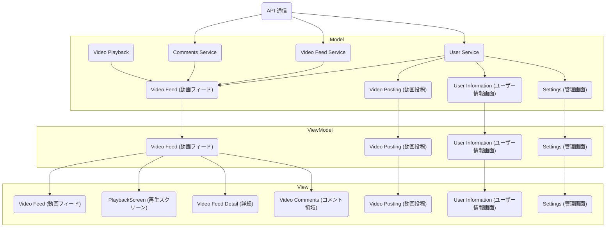
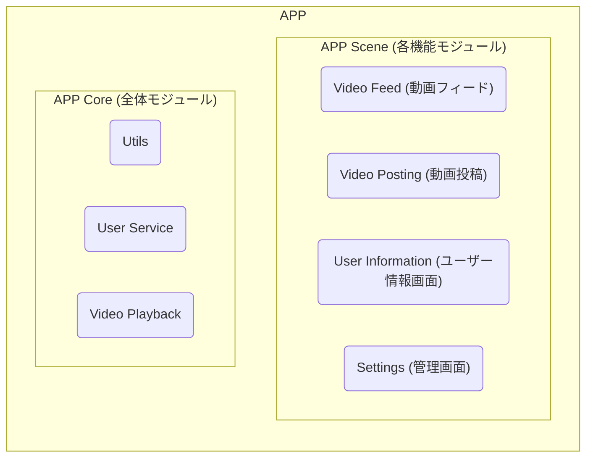
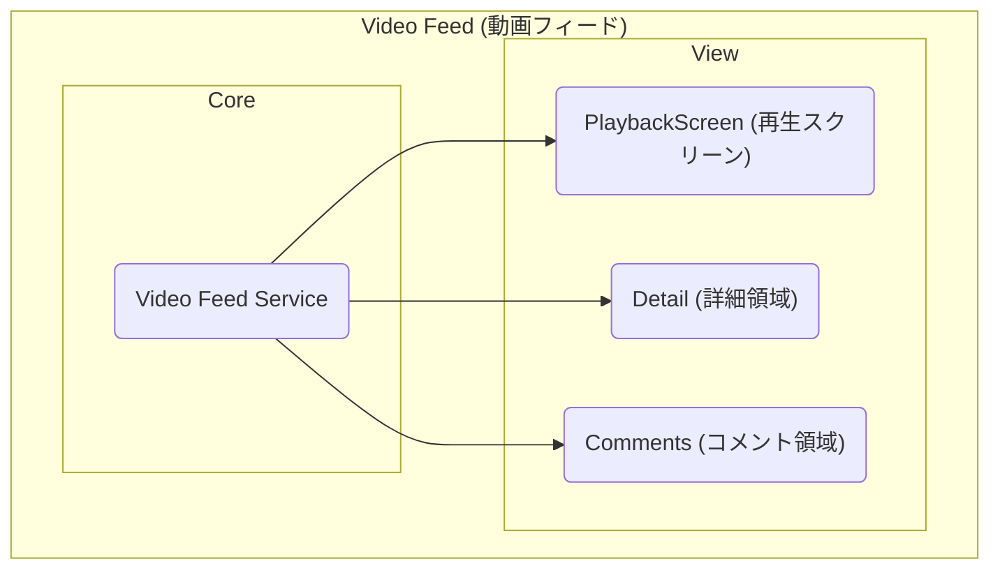
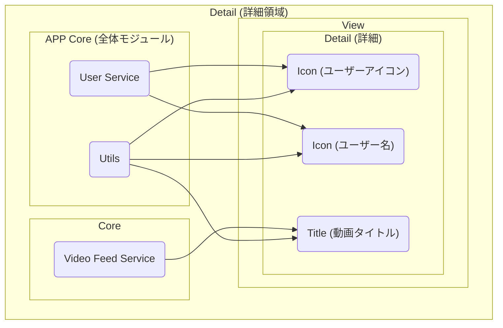
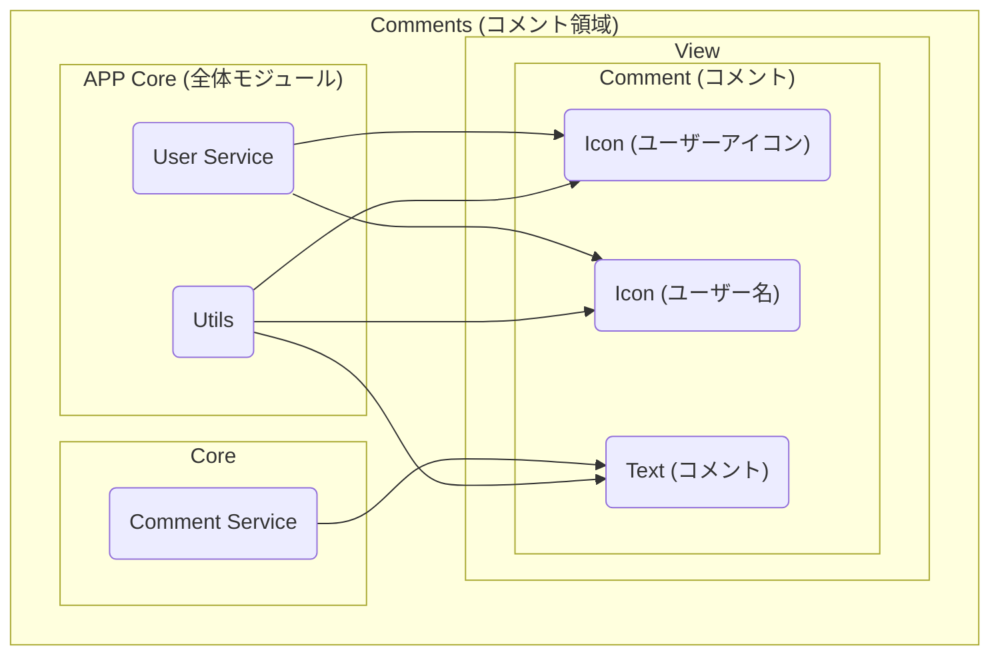

## 設計

### 設計 A

- Model、View、ViewModel、API、 は、そのままディレクトリ構成となる

- データバインディング

  - ViewModel - View 間、Model - ViewModel 間で、双方向バインディング

- API 通信
  - API モジュール には、すべての API の URL、エンドポイント、DataClass、リクエストヘッダー情報が記述されている

### 設計 B

- 機能ごと(Core, Scene)に外部モジュール化されている
- 機能ごと(Core, Scene)の View には ViewModel が付随する
- Core は Service 単位で独立した外部モジュールとしている

- データバインディング

  - Core 層から 単方向バインディング

- API 通信
  - モジュール内の Service コンポーネントごとに API の URL、エンドポイント、DataClass、リクエストヘッダー情報が分散管理されている

#### APP

#### Scene : Video Feed (動画フィード)

##### Scene : Video Feed (動画フィード) / Detail (詳細)

##### Scene : Video Feed (動画フィード) / Comments (コメント領域)

